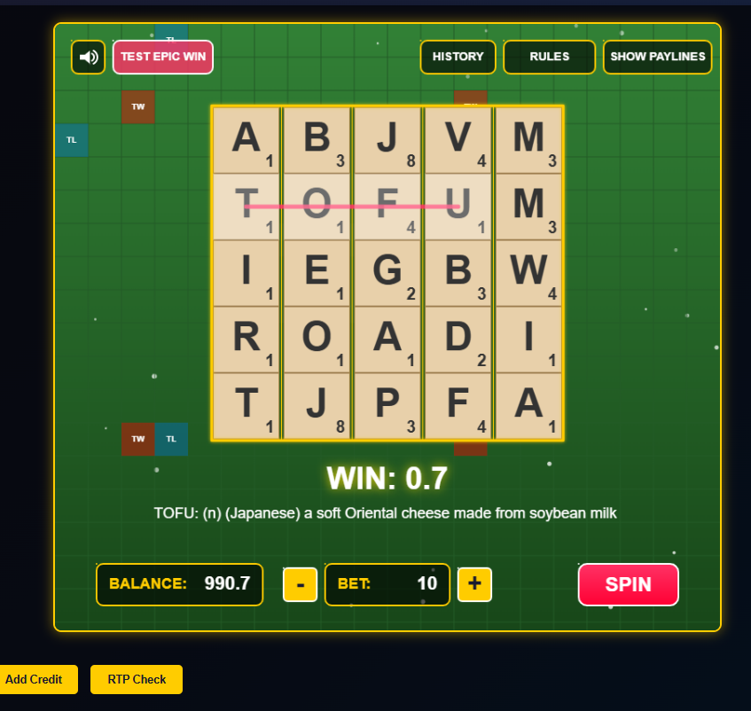

# Scrabble Slots

A unique slot machine game that combines the word-building fun of Scrabble with the excitement of slot machines.

Try it here: [Slot Game Demo](https://words.compsmart.co.uk)

## Game Overview

Scrabble Slots is an innovative slot machine game where players win by forming valid English words from the letters that appear on the reels. Unlike traditional slot machines that rely on matching symbols, Scrabble Slots rewards vocabulary skills and a bit of luck as players spin to create valuable words.

## How to Play

1. **Start the Game**: Load the game in your web browser.
2. **Adjust Your Bet**: Use the + and - buttons to set your wager amount.
3. **Spin the Reels**: Click the "SPIN" button to start playing.
4. **Look for Words**: The game automatically searches for valid English words in the horizontal rows and vertical columns.
5. **Collect Winnings**: Win credits based on the words found, their length, and the value of each letter.
6. **Check History**: View your play history to see all the words you've found.

## Game Rules

### Word Formation

- Words can form horizontally (across rows) or vertically (down columns).
- Only the longest valid word in each row or column is counted.
- Words must be at least 3 letters long to qualify.
- All words must be valid English words found in the game's dictionary.

### Scoring System

- Each letter has a point value based on traditional Scrabble scoring:
  - 1 point: A, E, I, L, N, O, R, S, T, U
  - 2 points: D, G
  - 3 points: B, C, M, P
  - 4 points: F, H, V, W, Y
  - 5 points: K
  - 8 points: J, X
  - 10 points: Q, Z

- Word length multipliers determine the final score:
  - 3-letter words: 0.1× multiplier
  - 4-letter words: 0.1× multiplier
  - 5-letter words: 10× multiplier (Epic Win Bonus!)

### Special Tiles

The game features special letter tiles that can dramatically increase your score:

- **DL (Double Letter)**: Doubles the value of that specific letter
- **TL (Triple Letter)**: Triples the value of that specific letter
- **DW (Double Word)**: Doubles the total value of the entire word
- **TW (Triple Word)**: Triples the total value of the entire word

These special tiles are based on the classic Scrabble board layout, with bonus squares in strategic positions.

### Calculating Wins

1. Add up the values of all letters in the word
2. Apply any letter-specific multipliers (DL, TL) to individual letters
3. Apply the word length multiplier
4. Apply any word-wide multipliers (DW, TW)
5. Multiply by your bet amount

For example:
- The word "BAKE" contains B(3) + A(1) + K(5) + E(1) = 10 points
- As a 4-letter word, it gets a 0.1× multiplier
- Final win: 10 × 0.1 × your bet amount = 1 × your bet amount

If "BAKER" is found (a 5-letter word):
- B(3) + A(1) + K(5) + E(1) + R(1) = 11 points
- As a 5-letter word, it gets the epic 10× multiplier
- Final win: 11 × 10 × your bet amount = 110 × your bet amount!

### Important Notes

- Words with a length that has a multiplier of 0 won't score any points.
- The game will only count each letter tile once per spin.
- If multiple winning words are found, all of them pay!

## Special Features

### Epic Win Animation

When you hit a particularly valuable word, the game celebrates with an epic animation featuring:
- Flying Scrabble tiles
- Word jackpot celebration
- Special background effects

### Game History

The game keeps track of your spins, showing:
- Time of each spin
- Bet amount
- Score (winnings)
- Number of words found
- Return percentage

## Strategy Tips

- Look for letter combinations that can form multiple words to increase your chances of winning.
- Higher-value letters like J, Q, X, and Z can lead to bigger wins.
- Longer words generally provide better returns due to the increased multipliers.

## Technical Information

This game uses a dictionary of valid English words stored in the words.txt file. The game performs RTP (Return to Player) simulations to ensure fair gameplay and appropriate payout rates.

---

Developed by Copilot Agent | © 2025
